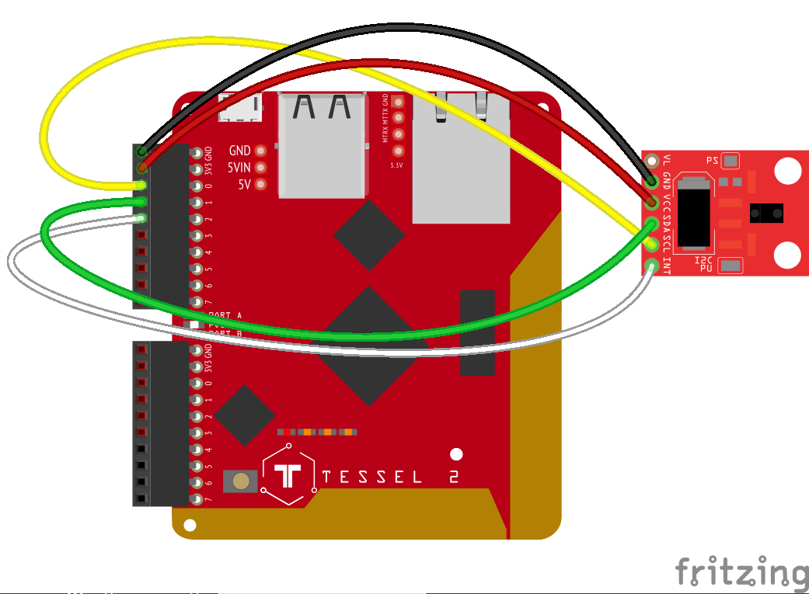

# apds9960
Johnny-Five Plugin for APDS-9960 (Gesture) Sensor

Designed for Tessel 2, but adaptible to other 3.3V Johnny-Five-compatible platforms.

## Wiring

The APDS-9960 connection is I2C (SDA, SCL, +3.3V, GND), as well as an additional interrupt (here shown to pin `A2` on the Tessel).

_Note_: The APDS-9960 is a 3.3V part. Don't try to use it with a 5V board!

## Installation

Assuming a connected/provisioned Tessel 2:

1. Clone/Fork
2. `npm install`
3. `t2 run index.js --lan`
